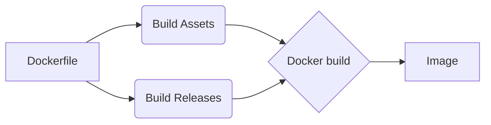

# WikiJS

Esse documento tem o objetivo de demonstrar o passo a passo para a criação de um *Dockerfile* para a criação de uma imagem, e o *deployment* do *WikiJS*, um projeto *open-source* de *Wiki* escrito em *Javascript*. 

## Repositório
Estaremos utilizando o [repositório](https://github.com/Requarks/wiki) oficial do projeto, com a *release* mais atualizada. Nesse repositório encontramos vários arquivos com diferentes finalidades, tais como: Garantir a segurança da imagem, gerenciamento de *pipelines*, dependências da imagem, licença, entre outras. Para obter o repositório, utilizaremos o git.

    git clone https://github.com/Requarks/wiki.git

## Dockerfile
O arquivo que focaremos nesse documento será o *Dockerfile*, responsável pela possibilidade da criação da imagem em qualquer ambiente, tornando a aplicação bastante portátil. 
O documento responsável pela criação da imagem situa-se em [/wiki/dev/build/Dockerfile](https://github.com/Fellipe-A/wikiJS/blob/main/dev/build/Dockerfile). No mesmo diretório encontramos também o *config.yml*, necessário para descrever as configurações básicas da aplicação, como os parâmetros do banco de dados e configurações de encriptação, por exemplo.
O documento oficial utiliza a criação de imagens em multi-estágios, técnica utilizada para a otimização de *Dockerfiles*, mantendo um arquivo de fácil leitura e manutenção.  Além disso, acarreta numa maximização do *cache* das camadas da imagem.
 
    # ====================
    
    # --- Build Assets ---
    
    # ====================
    
    FROM node:14-alpine AS assets
    
    RUN apk add yarn g++ make python --no-cache
    
    WORKDIR /wiki
    
    COPY ./client ./client
    
    COPY ./dev ./dev
    
    COPY ./package.json ./package.json
    
    COPY ./.babelrc ./.babelrc
    
    COPY ./.eslintignore ./.eslintignore
    
    COPY ./.eslintrc.yml ./.eslintrc.yml
    
    RUN yarn cache clean
    
    RUN yarn --frozen-lockfile --non-interactive
    
    RUN yarn build
    
    RUN rm -rf /wiki/node_modules
    
    RUN yarn --production --frozen-lockfile --non-interactive
    
    # ===============
    
    # --- Release ---
    
    # ===============
    
    FROM node:14-alpine
    
    LABEL maintainer="requarks.io"
    
    RUN apk add bash curl git openssh gnupg sqlite --no-cache && \
    
    mkdir -p /wiki && \
    
    mkdir -p /logs && \
    
    mkdir -p /wiki/data/content && \
    
    chown -R node:node /wiki /logs
    
    WORKDIR /wiki
    
    COPY --chown=node:node --from=assets /wiki/assets ./assets
    
    COPY --chown=node:node --from=assets /wiki/node_modules ./node_modules
    
    COPY --chown=node:node ./server ./server
    
    COPY --chown=node:node --from=assets /wiki/server/views ./server/views
    
    COPY --chown=node:node ./dev/build/config.yml ./config.yml
    
    COPY --chown=node:node ./package.json ./package.json
    
    COPY --chown=node:node ./LICENSE ./LICENSE
    
    USER node
    
    VOLUME ["/wiki/data/content"]
    
    EXPOSE 3000
    
    EXPOSE 3443
    
    # HEALTHCHECK --interval=30s --timeout=30s --start-period=30s --retries=3 CMD curl -f http://localhost:3000/healthz
    
    CMD ["node", "server"]

### *Build Assets*
A primeira etapa, descrita como *Build assets* é responsável pela instalação dos requisitos básicos. Primeiramente, a partir da imagem do Node baseada na distribuição Alpine (recomendado pela remoção de arquivos não necessários, ocasionando numa redução do tamanho da imagem e menor brecha para falhas, tendo em vista que apenas os pacotes essenciais estarão presentes), os pacotes básicos para o funcionamento da aplicação são instalados. Em seguida os arquivos da aplicação são copiados para a imagem de criação do container. 

    FROM node:14-alpine AS assets
    
    RUN apk add yarn g++ make python --no-cache
    
    WORKDIR /wiki
    
    COPY ./client ./client
    
    COPY ./dev ./dev
    
    COPY ./package.json ./package.json
    
    COPY ./.babelrc ./.babelrc
    
    COPY ./.eslintignore ./.eslintignore
    
    COPY ./.eslintrc.yml ./.eslintrc.yml

Por fim, utilizando o Yarn um gerenciador de pacotes Javascript mais eficiente que o npm (gerenciador padrão do Node) é realizado a instalação das dependências e o *build* da aplicação.   

    RUN yarn cache clean
    
    RUN yarn --frozen-lockfile --non-interactive
    
    RUN yarn build
    
    RUN rm -rf /wiki/node_modules
    
    RUN yarn --production --frozen-lockfile --non-interactive

### Release

A segunda etapa da criação da imagem é a criação dos diretórios não estáticos, como os diretórios de *logs*. 

    FROM node:14-alpine
    
    LABEL maintainer="requarks.io"
    
    RUN apk add bash curl git openssh gnupg sqlite --no-cache && \
    
    mkdir -p /wiki && \
    
    mkdir -p /logs && \
    
    mkdir -p /wiki/data/content && \

Em seguida,  definimos o diretório onde os comando serão aplicados dentro do *container*, e então é realizada a alteração do proprietário do arquivo para node.  Na sequência declaramos o usuário que será o responsável pelo processo. Tal mudança de extrema importância no que tange à segurança, fazendo com que o container não funcione com os privilégios de *root*, evitando a elevação de privilégios em códigos maliciosos. 

    chown -R node:node /wiki /logs
    
    WORKDIR /wiki
    
    COPY --chown=node:node --from=assets /wiki/assets ./assets
    
    COPY --chown=node:node --from=assets /wiki/node_modules ./node_modules
    
    COPY --chown=node:node ./server ./server
    
    COPY --chown=node:node --from=assets /wiki/server/views ./server/views
    
    COPY --chown=node:node ./dev/build/config.yml ./config.yml
    
    COPY --chown=node:node ./package.json ./package.json
    
    COPY --chown=node:node ./LICENSE ./LICENSE
    
    USER node
    
Então, declaramos o volume a ser montado no *host* e persistido, para que seja possível utilizar em outros *containers*, e definimos as portas à serem escutadas pelo serviço. Por fim, há um comando para checar a saúde da aplicação e então é definido o comando padrão a ser utilizado na inicialização do *container*, responsável por manter o processo ativo.

    VOLUME ["/wiki/data/content"]
    
    EXPOSE 3000
    
    EXPOSE 3443
    
    # HEALTHCHECK --interval=30s --timeout=30s --start-period=30s --retries=3 CMD curl -f http://localhost:3000/healthz
    
    CMD ["node", "server"]

## Construindo a imagem

Para construir a imagem, utilizamos o  *docker build* no diretório raiz do projeto.

    docker build -t wiki -f /dev/build/Dockerfile .
Após execução do comando acima, o processo de criação da imagem será iniciado. (Em um dos processos do *build*, me surgiu dúvida a respeito das mensagens de warning). Com o  *docker images*, verificamos que a imagem foi criada com a tag "wiki".

Como boa prática, realizamos um escaneamento de vulnerabilidades na imagem. Para tal, uma ferramenta nativa do Docker será utilizada.

    docker scan wiki

Em nosso caso, apesar dos warnings apresentados durante a criação da imagem, nenhuma vulnerabilidade foi encontrada na imagem.

## *Deployment*

Em caráter de testes, utilizaremos um docker-compose.yml, arquivo que define a criação dos serviços e torna a tarefa de *deployment* bem simples. Tal arquivo encontra-se no mesmo diretório do Dockerfile. 
No docker-compose estaremos definindo e criando o serviço de banco de dados necessário para o funcionamento do Wiki, como também a declaração do serviço Wiki utilizando a imagem criada acima. 

    version:  "3"
    
    services:
    
    db:
    
    image:  postgres:11-alpine
    
    environment:
    
    POSTGRES_DB:  wiki
    
    POSTGRES_PASSWORD:  wikijsrocks
    
    POSTGRES_USER:  wikijs
    
    logging:
    
    driver:  "none"
    
    restart:  unless-stopped
    
    volumes:
    
    -  db-data:/var/lib/postgresql/data
    
      
    
    wiki:
    
    image:  wiki:latest
    
    depends_on:
    
    -  db
    
    environment:
    
    DB_TYPE:  postgres
    
    DB_HOST:  db
    
    DB_PORT:  5432
    
    DB_USER:  wikijs
    
    DB_PASS:  wikijsrocks
    
    DB_NAME:  wiki
    
    restart:  unless-stopped
    
    ports:
    
    -  "80:3000"
    
    -  "443:3443"
    
      
    
    volumes:
    
    db-data:

Por recomendação para melhor *performance*, atualizações e compatibilidade, utilizamos o PostgreSQL. Como estaremos utilizando um ambiente de testes, optamos por não utilizar o Docker Secrets nos parâmetros confidenciais. 

No diretório /build, utilizamos o *docker-compose up -d* para fazer com que os containers com cada serviço sejam criados. 

 
 Sendo assim, ao abrir o navegador em *localhost* (em nosso caso), já podemos observar a página inicial de cadastro para o administrador do *wiki*.
 

Durante a etapa de teste, após a realização do cadastro aconteceu um erro onde o container do wiki tentava reiniciar indefinidamente. Ao analisar os logs, verifiquei o erro abaixo:

O problema foi contornado após inserir tal depêndencia no package.json.
>"graphql-upload":  "12.0.0",

Após isso, simplesmente fiz um *re-build* na imagem, reiniciei o serviço e tudo funcionou normalmente, como verificamos na imagem abaixo. 
 
# Conclusão
Portanto, com a documentação realizada se torna fácil realizar o *deployment* em diversos ambientes com a facilidade de alguns comandos ou simplesmente automatizando alguns processos de deployment, tais como pipelines. 
O diagrama abaixo nos dá uma visão geral acerca do Dockerfile apresentado nessa documentação.

Alguns contratempos foram encontrados durante o percurso, porém, contornados com soluções simples.
